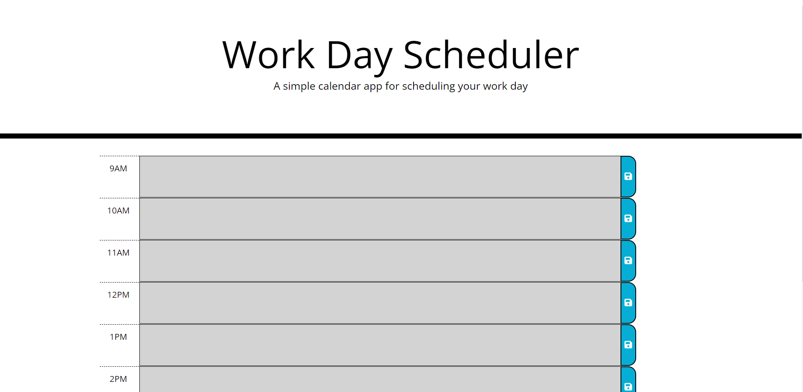

# day-planner

# Project Description 

In the 5th challenge of the bootcamp, I set out to make myself a day planner. The planner should have blocks to add works plans from 9-5 and save them. The times should be color coded depending on the time of day.   

# Installation 

To view the project, clone the git repository using VS Code. this will allow you to vie the index.html file ass well as the css style file. The website can be view by right clicking in the index.html file and opening via web browser. 

Link to deployed website: https://github.com/mitchgm/JavaScript-Code-Quiz 

# Usage

 

# User Story

AS AN employee with a busy schedule
I WANT to add important events to a daily planner
SO THAT I can manage my time effectively

# Acceptance Criteria

GIVEN I am using a daily planner to create a schedule
WHEN I open the planner
THEN the current day is displayed at the top of the calendar
WHEN I scroll down
THEN I am presented with time blocks for standard business hours
WHEN I view the time blocks for that day
THEN each time block is color-coded to indicate whether it is in the past, present, or future
WHEN I click into a time block
THEN I can enter an event
WHEN I click the save button for that time block
THEN the text for that event is saved in local storage
WHEN I refresh the page
THEN the saved events persist

# Changelog

v1.0.0
--------------------------------
- created the readme file
- updated html to comply with semantic best practices
- updated html to optimize SEO and accessibility 
- updated css
- updated css and html to provide a better user experience
- created a repo on github
- fixed image pathing
- created javascript files
- implemented jquery

# License

Copyright (c) 2021 Mitch Marena 

Permission is hereby granted, free of charge, to any person obtaining a copy
of this software and associated documentation files (the "Software"), to deal
in the Software without restriction, including without limitation the rights
to use, copy, modify, merge, publish, distribute, sublicense, and/or sell
copies of the Software, and to permit persons to whom the Software is
furnished to do so, subject to the following conditions:

The above copyright notice and this permission notice shall be included in all
copies or substantial portions of the Software.

THE SOFTWARE IS PROVIDED "AS IS", WITHOUT WARRANTY OF ANY KIND, EXPRESS OR
IMPLIED, INCLUDING BUT NOT LIMITED TO THE WARRANTIES OF MERCHANTABILITY,
FITNESS FOR A PARTICULAR PURPOSE AND NONINFRINGEMENT. IN NO EVENT SHALL THE
AUTHORS OR COPYRIGHT HOLDERS BE LIABLE FOR ANY CLAIM, DAMAGES OR OTHER
LIABILITY, WHETHER IN AN ACTION OF CONTRACT, TORT OR OTHERWISE, ARISING FROM,
OUT OF OR IN CONNECTION WITH THE SOFTWARE OR THE USE OR OTHER DEALINGS IN THE
SOFTWARE.